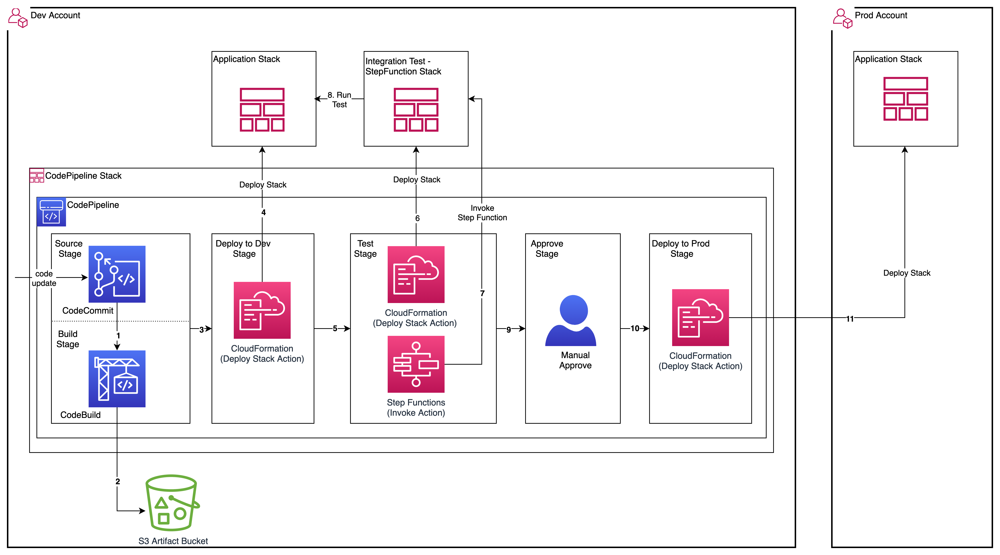
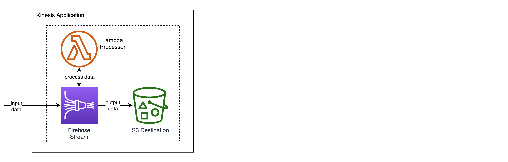
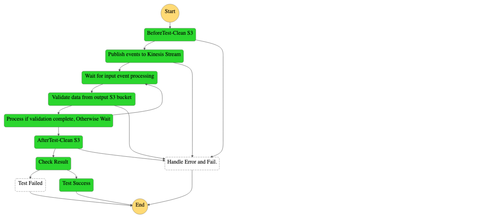

# AWS CodePipeline integration with AWS Step Functions

This project contains Typescript CDK for a CodePipeline stack which invokes a Step Functions workflow to test a Kinesis application.
CodePipeline’s integration with Step Functions helps to maintain a simple release pipeline and delegate the behavior of complex workflows to a Step Functions state machine.
From the Step Function’s console, you can browse execution logs and visualize the workflow to support troubleshooting.

## Architecture

* ### CodePipeline with Step Functions invoke action:


* ### Sample Kinesis Application deployed:
  The sample application stack contains a Firehose stream with a Lambda processor and S3 destination.
The lambda processor appends the 'arrival_timestamp' key:value to each input data record. The output data is stored in the S3 destination of the firehose stream. 
This pattern can be used to test an application/infrastructure stack by defining the appropriate Step Function workflow in the IntegrationTest stack.




* ### Integration Test using StepFunctions state machine:
  The sample IntegrationTest stack deployed contains a Step Functions workflow which generates input data for the firehose stream and validate the output data. 
The execution steps are performed by Lambda functions defined using Boto3 (Python SDK for AWS).




## Steps to deploy the Pipeline and Application stacks

* ### Pre-requisites
  * Install AWS CLI, Git, Node.js, TypeScript
  * Install AWS CDK v1.120 (For later versions, you can update the package.json)
  * 2 AWS accounts are required - (to be used as Dev and Prod accounts)
  * IAM user with HTTPS Git credentials for CodeCommit in Dev Account 
<br/>
  
* ### Product versions
  * AWS CDK V1.120
  * AWS SDK for Python (Boto3) V1.18
  * Python 3.7+
  * Node.js 14, TypeScript V3.9
<br/>
  
* ### Setup KMS Key, Artifact Bucket, IAM Roles

```shell
# Configure aws named-profiles for dev and prod environments
aws configure --profile dev
aws configure --profile prod

# Clone repository
git clone https://gitlab.aws.dev/pipeline/aws-codepipeline-sfn-statemachine-cdk
cd aws-codepipeline-sfn-statemachine-cdk

# Install NodeJS dependencies
npm i

# Create KMS Key
cdk deploy CodeCommitStack --profile dev

# Note the CodeCommit repository url from stack outputs
# Update parameter values in cdk.context.json. Set the kms key id, account ids, role names

# Create IAM Stack
cdk deploy CrossAccountIamStack --profile prod


```

* ### Deploy CodePipeline stack
```shell
# Create CodePipeline
cdk deploy CodePipelineStack --profile dev

```
* ### Upload code to CodeCommit repository and Trigger the codepipeline
```shell
# Re-initialize current git repository to push code to the CodeCommit repository
# Remove current .git, initialize git
rm -rf .git
git init  
git branch -m main # Optional if default branch is already main

# Set remote origin, use the CodeCommit url from the stack outputs of the CodePipeline stack
git remote add origin https://git-codecommit.us-east-1.amazonaws.com/v1/repos/aws-codepipeline-stepfunctions-1-cdk

# Commit and Push code
git add -A && git commit -m "initial commit"
git push -u origin main

# Provide the HTTPS credentials for the CodeCommit repository IAM user
# The pipeline should start executing. Monitor pipeline execution from the AWS Console for CodePipeline

```
